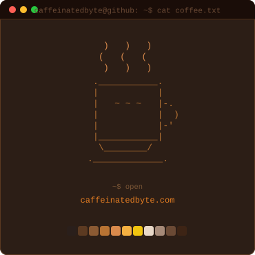
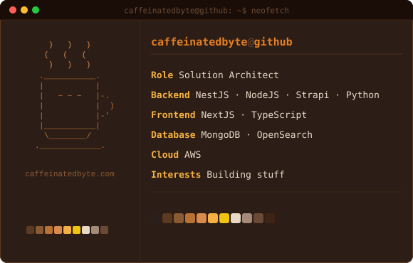

<!-- ─── Header ─────────────────────────────────────────── -->
<h1>☕ caffeinatedbyte</h1>

  <strong>Solution Architect &nbsp;·&nbsp; Backend Engineer &nbsp;·&nbsp; Full‑Stack</strong>

<!-- Website badge -->

&nbsp;

<!-- Tech stack badges -->

  

<!-- ─── Contributions ─────────────────────────────────── -->
<h3><code>caffeinatedbyte@github ~ $ ./contributions.sh</code></h3>

  

<!-- ─── whoami ───────────────────────────────────────── -->
<h3><code>caffeinatedbyte@github ~ $ whoami</code></h3>

<table>
  <tr>
    <td valign="top"></td>
    <td valign="top"></td>
  </tr>
</table>

 

Powered by ☕ caffeinatedbyte &nbsp;·&nbsp; <a href="https://caffeinatedbyte.com">caffeinatedbyte.com</a>

